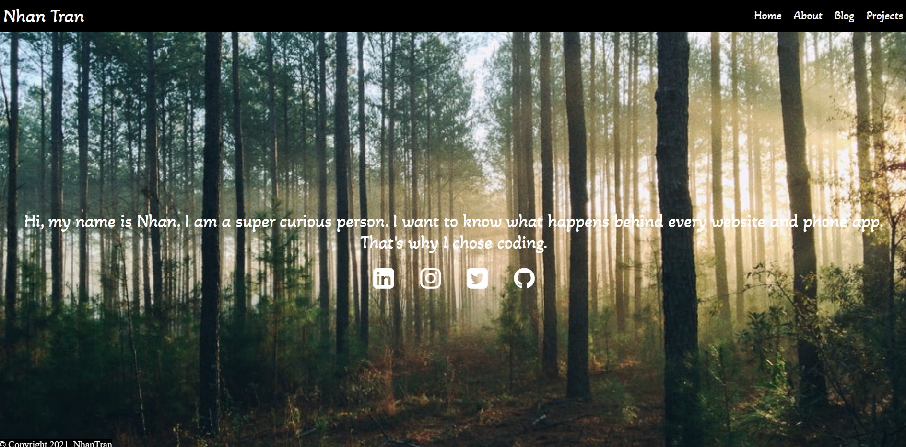
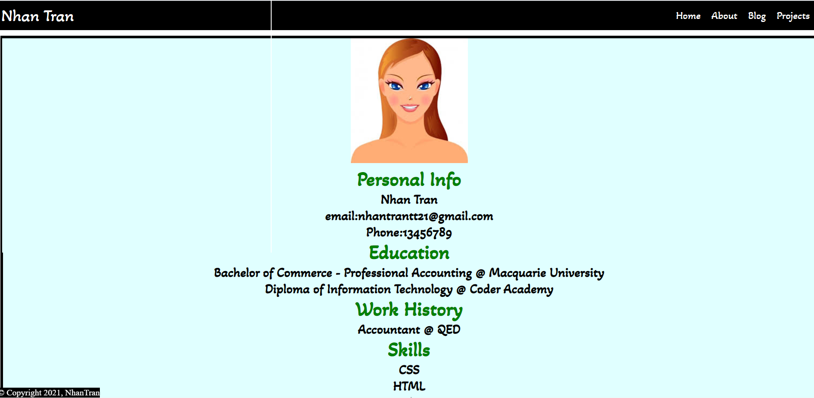
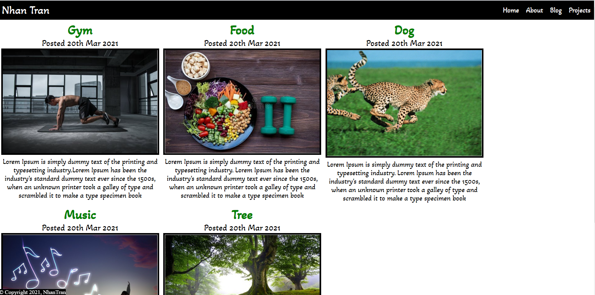
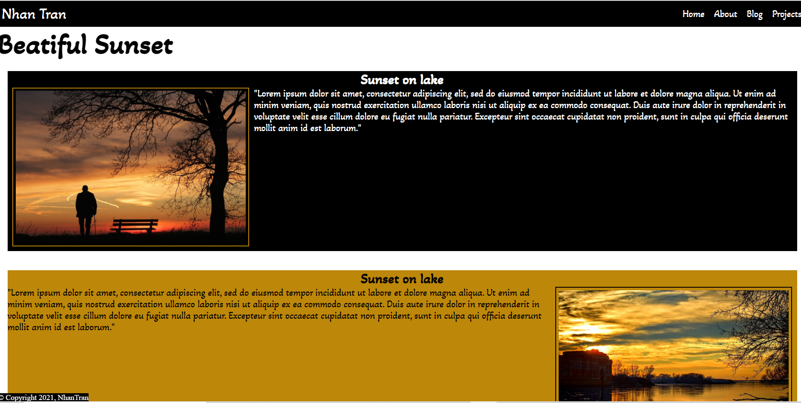

## Purpose: 
The purpose of this website is to strengthen my knowledge of HTML and CSS. It is a mobile friendly use that links to my CV and contact details such As Github and Linkedin.
## Functionality / Features: 
### *** Homepage
#### NavBar: 
contains the links to connect all four pages which are Home, About, Blog and Projectc. Nav Bar is built across of pages.

#### Footer: 
contains copy right on the top left corner of the page.
Main-content: this part consists of a background image, introduction about me and social links. The icons of these links are placed horizontally in the middle. However, they are vertically positioned when being used on phone. Also, the letters on the description part also shrink down a bit smaller. 

### ***About page: 
This page contains a brief CV and a download button of a PDF file. The page will change color when being used on phone to interact with users more easily.

### ***Blog page: 
This page has 5 posts with date of posted, contents and images. The images are aligned in photo frame by using float. They are vertically positioned while using on phone. Line height and line break are also increased to read easier.

### *** Projects page: 
This page is an extra experience to practise more skills on HTML and CSS.

## Sitemap

## Screenshots
### Main Page

### About Page

### Blog Page

### Projects Page

## Link to my webpage
https://nhantrantt21.netlify.app/
